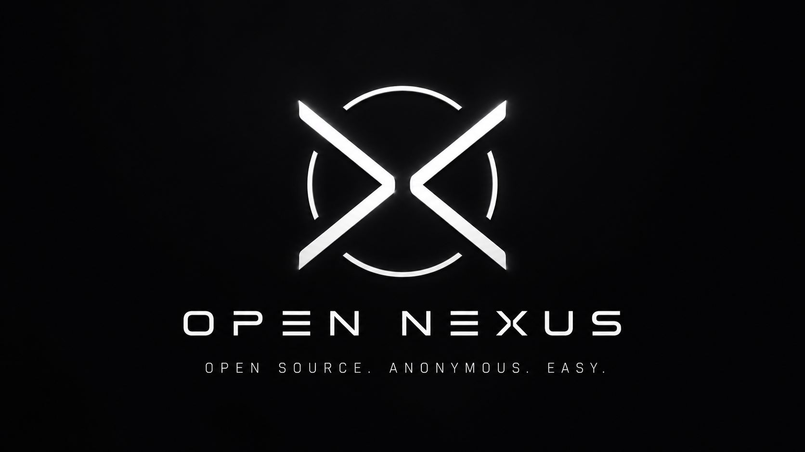

<p align="center">
  
</p>

<p align="center">
  <h1 align="center">Open Nexus</h1>
</p>

<p align="center">
  <strong>A premium desktop and terminal AI orchestration environment for professional local workflows.</strong>
</p>

<p align="center">
  
  
  
</p>

---

Open Nexus is more than just a chat app. It is a shared AI core that integrates directly with your system to inspect files, propose precise diffs, automate terminal tasks, and help manage complex projects. Whether you're using a local LLM via Ollama or a cloud powerhouse like GPT-4, Open Nexus provides the bridge to your actual workspace.

> [!IMPORTANT]
> **Solo Developer Project**: Open Nexus is crafted with passion by a solo developer. While it is built to be powerful, it is still an evolving project and may occasionally encounter edge cases. Your support, feedback, and patience help make it better every day!

---

## 🚀 Key Features

| Feature | Description |
| :--- | :--- |
| **Workspace Aware** | Analyzes your project structure and file contents to provide context-aware assistance. |
| **GUI Workspace** | A sleek Electron interface with a built-in file explorer and code editor. |
| **Terminal First** | A powerful CLI (`nexus`) that lets you control the AI from any terminal session. |
| **Diff Flow** | AI-proposed changes are presented as interactive diffs—review and apply with one click. |
| **Multi-Provider** | Support for Ollama, LM Studio, OpenAI, Anthropic, Gemini, OpenRouter, and more. |
| **Remote Access** | Control your machine securely via a Telegram bot with authorized chat ID filtering. |
| **Auto-Updates** | Stays current by automatically synchronizing with the official GitHub repository on launch. |
| **Voice Synthesis** | Advanced TTS (Piper/System) to read responses aloud without the technical junk. |

---

## 🛠️ Installation & Setup

> [!NOTE]
> **OS Support**: Open Nexus currently only supports **Windows**. Support for **macOS** and **Linux** is planned for future releases.

Get Open Nexus running on your machine in just a few steps.

### 1. Clone the repository
```cmd
git clone https://github.com/Kapustiack/Open-Nexus.git
cd Open-Nexus
```

### 2. Install & Build
You have two options to set up the environment:

**Option A: Automated (Recommended)**
Simply run the setup script and it will handle everything for you:
```cmd
setup.bat
```

**Option B: Manual**
If you prefer to run commands manually:
```cmd
npm install
npm run build
```

### 3. Launch
Once the installation is complete, you can start the application:

- **Desktop App**: `npm start`
- **Terminal Mode**: `npm run cli`

### 4. Global CLI Access (Optional)
To use the `nexus` command anywhere on your system:
```cmd
npm install -g .
nexus
```

---

## 💬 CLI Commands

In terminal mode, use these slash commands to orchestrate your environment:

| Command | Usage |
| :--- | :--- |
| `/help` | Display all available commands |
| `/settings` | Show active provider, model, and workspace status |
| `/provider <name>` | Quickly switch between AI backends |
| `/model <name>` | Select a specific model for the current provider |
| `/workspace <path>` | Shift the AI's focus to a different project folder |
| `/telegram <subcmd>`| Configure the Remote Access bot (token, allow, toggle) |
| `/jailbreak <on\|off>`| Toggle workspace safety boundaries |
| `/autodiscovery` | Enable/disable automatic local AI detection |

---

## 🤖 Telegram Remote Access

Control your development environment and your PC from anywhere in the world using Telegram.

### 1. Initial Setup
1.  **Create a Bot**: Message [@BotFather](https://t.me/botfather) on Telegram and follow the steps to get your **Bot Token**.
2.  **Configure Open Nexus**:
    *   **GUI**: Open the Desktop app, go to **Settings > Remote Access**, and paste your Token.
    *   **CLI**: Use `/telegram token <your_token>` to save it.

### 2. Authorization (Security)
By default, the bot is restricted. You must authorize specific users to interact with it:
- Find your User ID or use your **@username**.
- **GUI**: Add your username or ID to the "Allowed Chat IDs" list.
- **CLI**: Use `/telegram allow @YourUsername`.
- **Note**: You can add multiple users separated by commas.

### 3. Launching the Bot
The Telegram connection runs as a background service. To start it:

- **Via CLI**: Use the command `/telegram start` inside the Nexus terminal.
- **Via Console**: Run the following command in your project folder:
  ```cmd
  npm run telegram:bot
  ```
*Note: If you use the console command, keep the window open to keep the bot active.*
*Keep this terminal window open to keep the bot active.*

### 4. Features & Usage
Once connected, you can chat with Open Nexus just like the CLI:
- **PC Control**: Ask it to "Open Chrome to youtube.com" or "Start Notepad."
- **File Management**: "Read main.py" or "Create a new folder called tests."
- **Terminal**: Run any system command remotely (if *Allow Terminal* is enabled in settings).

> [!CAUTION]
> **Remote Power**: Enabling "Allow Terminal" and "Jailbreak" gives the bot full control over your computer. Only authorize users you trust implicitly.

---

## 🔄 Auto-Updates

Open Nexus is designed to be "set and forget." Every time you launch the application (GUI or CLI), it checks for the latest improvements on [GitHub](https://github.com/Kapustiack/Open-Nexus). If an update is found, it is automatically pulled and applied. Just restart the app when prompted to enjoy the latest features.

---

## 🌐 Supported Providers

Open Nexus connects to almost any major AI backend:
- **Local**: Ollama, LM Studio
- **Cloud**: OpenAI, Anthropic, Gemini, DeepSeek, Mistral, xAI
- **Aggregators**: OpenRouter, Together AI, Perplexity, Groq

---

## ⚠️ Safety & Privacy

Open Nexus is built for automation. It can execute commands and modify files according to AI proposals. 
- **Always review diffs** before applying them.
- **Authorized IDs**: Use specific chat IDs for Telegram to prevent unauthorized access.
- **Jailbreak Mode**: Be cautious when disabling workspace boundaries.

---

<p align="center">
  Built with ❤️ by a solo developer for the developer community.
</p>
